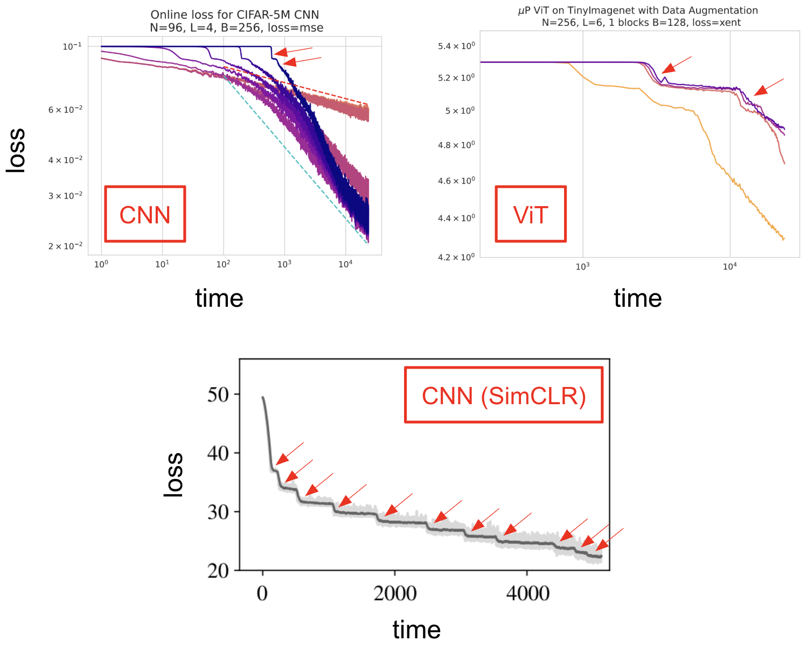

When a neural network is trained in a typical fashion, its loss drops relatively smoothly and continuously. However, when trained from small initialization, its loss tends to drop in a series of discrete steps with plateaus in between, much like a [deep linear network](/deep-linear-nets). See examples below. These steps blur together and eventually disappear as the initialization scale increases. This suggests the tantalizing possibility that this behavior was "in there all along" and that taking initialization to be small simply makes this clear at the level of the loss curve.

 <strong>Realistic models trained from small initialization show stepwise learning.</strong> Plots show loss trajectories from CNNs and ViTs <a href="https://arxiv.org/abs/2410.04642">(Atanasov et al., 2024; Figures 2 and 16)</a> and a ResNet trained in a self-supervised fashion with SimCLR loss <a href="https://arxiv.org/abs/2303.15438">(Simon et al., 2023; Figure 2)</a>. Do these steps reveal something fundamental about the training process of deep neural networks?

This would be big if true: the training process of a deep neural network is messy, continuous, high-dimensional, and defies simple characterization. However, a series of discrete steps which can be cleanly separated from one another seems much easier to deal with, since each step could then be studied in isolation. This is exactly the story in deep linear networks: the learning process naturally decomposes into a sequence of subproblems, each with low-rank dynamics, which may be studied mostly independently.
[>See also [developmental interpretability](https://www.lesswrong.com/posts/TjaeCWvLZtEDAS5Ex/towards-developmental-interpretability), which seeks to understand learning as a series of discrete "phase changes." If this hope is borne out, these discrete steps might well be the low-rank saddle escapes discussed here. A study of stepwise, saddle-to-saddle dynamics in deep nonlinear networks is thus a possible avenue towards concretizing this vision. Also worth noting is that these saddle-to-saddle steps tantalizingly resemble the sequential acquisition of quanta, so it is possible that this stone will hit several birds.<]

So: is it true? Does a deep neural network trained from infinitesimal initialization follow a perfect saddle-to-saddle trajectory? When the same network is trained normally, does this idealized saddle-to-saddle trajectory remain a useful approximation of the learning process, and can we thereby gain insight into what is learned and how?
