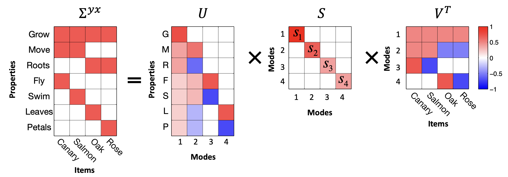

A neural network being trained is a tangled mess of parameters and activations changing through time. It would be nice, to put it mildly, to have some higher-level picture of what is going on. One approach to this sort of difficulty, particularly beloved by physicists, is to build and solve toy models. This approach goes roughly as follows. First, you identify one or more important effects you’re observing: qualitative or quantitative phenomena that might have some deeper underlying cause. Next, you construct a simple mathematical model that displays these same effects, usually by stripping away aspects of the system that are inessential to the phenomena of interest. Finally, you mine the toy model for deeper insights and for new predictions you can check against your original system. If this all works, you end up knowing new and useful things about the system you really care about.

A successful example of this approach is the study of *deep linear networks*, i.e., deep neural networks with no nonlinear activation functions. These networks are a useful toy model of some aspects of neural network training dynamics. To start, here are four pieces of folklore about neural networks:

1) they preferentially learn certain functional directions before others;{fn: This goes by many names in the literature: simplicity bias, inductive bias, spectral bias, and the frequency principle. [Nakkiran et al. (2019)](https://arxiv.org/abs/1905.11604) for a nice illustration of this concept. Also see [Open Direction 3](/openquestions/characterizing-simplicity-bias).}
2) they optimize to good (and sometimes global) minima despite having highly nonconvex loss landscapes;{fn: This was the fact that launched a wave of studies about overparameterized optimization in the late 2010s. Modern LLMs are not optimized all the way to minimizers, but the point stands that their optimization is apparently unhindered by their extreme nonconvexity.}
3) at any given point in training, each weight matrix’s typical updates are low-rank compared to the full matrix;{fn: This one is particularly interesting in that you can reach it from a few different angles. First, the low-rankness of gradient updates is a guiding intuition in the "μP" account of feature-learning dynamics; see [Yang et al. (2023; especially Figure 1)](https://arxiv.org/abs/2310.17813). Second, [LoRA](https://arxiv.org/abs/2106.09685) is a famous practical hack which takes advantage of (and only works because of) this low-rank learning behavior. Third, [Boix-Adserà et al. (2023)](https://arxiv.org/abs/2306.07042) directly observe this sort of instantaneous low-rank learning behavior in transformers.} and
4) they sometimes learn in a stepwise fashion with long plateaus punctuated by loss drops, especially when trained from very small initial weights.{fn: This is a common behavior seen across many model classes. [Simon et al. (2023)](https://arxiv.org/abs/2303.15438) see this behavior in self-supervised image models, [Atanasov et al. (2024; Figures 2 and 16)](https://arxiv.org/abs/2410.04642) in supervised CNNs and ViTs, [Boix-Adserà et al. (2023)](https://arxiv.org/abs/2306.07042) in toy transformers, and [Kunin et al. (2025)](https://arxiv.org/abs/2506.06489) in shallow MLPs.}

We’ll see that, amazingly, deep linear networks capture all of these behaviors in one solvable system. This is why they’re so highly valued as toy models. Most of this article will be a tutorial on deep linear networks: we’ll set up the problem, solve it, and extract intuition. At the end, we’ll return to these four pieces of folklore with a new perspective.

Our story is going to be a bit ahistorical: deep linear networks are fairly old (which in deep learning means there are seminal studies from more than a decade ago), while these four pieces of folklore mostly solidified later. This history is a little different from the canonical toy model flow, where the phenomena are identified first and the toy model is invented to explain them. In this case, a toy model designed to capture some facets of deep learning (namely, nonconvex loss landscapes) later turned out to also capture others. This doesn’t invalidate the story we’re telling, and if anything, it’s a strong testament to the fact that, as toy models, deep linear networks are really useful.

## A first look: `word2vec`

To ease us into thinking about linear networks, we’re going to start by looking at [`word2vec`](https://arxiv.org/abs/1310.4546), an influential early word embedding model which later turned out to be analyzable as a deep linear network. `word2vec` learns vector representations for words by encouraging semantically similar words to cluster in embedding space. Despite its simplicity, it is the intellectual ancestor of today’s powerful LLMs, and we can gain insight about these modern language models by studying word embedding models&mdash;a deep linear network&mdash;as a distilled proxy.

`word2vec` trains a two-layer linear network by iterating over a training corpus. Upon encountering a word $i$ (encoded as a one-hot vector), the model embeds it using an embedding matrix $\mW_\text{e}$, then learns to predict all the neighboring words using an un-embedding matrix $\mW_\text{u}$: $\hat f(i) = \mW_\text{u} \mW_\text{e} \ve_i$. The model is trained using a contrastive algorithm inspired by logistic regression. To cleanly isolate the four folklore phenomena above, [Karkada et al. (2025a)](https://arxiv.org/abs/2502.09863) demonstrate that `word2vec` is approximately the following learning problem:
$$
\mathcal{L}(\mW_\text{e}, \mW_\text{u}) = \|\mM^\star - \mW_\text{u} \mW_\text{e} \|_F^2,
$${tip: $\mathcal{L}$: mean squared error loss function \n$\mM^\star$: target matrix\n$\mW_\text{e}$: embedding matrix\n$\mW_\text{u}$: un-embedding matrix\n}
where $\mM^\star$ is a fixed target matrix calculated from the corpus co-occurrence statistics.{fn: Learning problems with this struture are called *unweighted least-squares matrix factorization* problems. Matrix factorization has its own rich history; see [Srebro (2004)](https://home.ttic.edu/~nati/Publications/thesis.pdf) for a primer.}

This system looks mathematically very simple, but it’s nevertheless rich enough to pick up the complex representational structures that made `word2vec` famous, including "analogies" like ${\mathbf{man}} - {\mathbf{woman}} \approx {\mathbf{king}} - {\mathbf{queen}}$, where ${\mathbf{man}}$ is the embedding for the word "man" and so on. Importantly, its training dynamics are solvable, and these deep linear networks clearly exhibit the four folklore phenomena above:

`word2vec`-like models preferentially learn large singular directions before smaller ones, implicitly biasing the model towards low-rank solutions, especially in the limit of very small initialization. In this regime, learning separates into a sequence of distinct stages; during each, a new orthogonal direction is realized in embedding space, the rank of the embedding matrix increments, and the loss drops accordingly. Select the initialization variance of the embedding weights and choose the three principal components (PCs) you'd like to visualize. Then watch as the word embeddings gradually self-organize in the 3D subspace to reflect the underlying semantic structure.

## Our friend, the deep linear network

In order to quantitatively understand why deep linear networks exhibit sequential rank-incrementing learning, we would like to exactly solve for their training dynamics. Let's start by establishing the mathematical setting.

Suppose we have a dataset $\mathcal{D} = \left\{ (\vx_i, \vy_i) \right\}_{i=1}^n$ which consists of $n$ sample-target pairs, where the samples $\vx \in \R^{d_\text{in}}$ and targets $\vy \in \R^{d_\text{out}}$ are both vectors. A deep linear network maps vector inputs through a chain of matrix multiplications:

$$
\hat{f}(\vx) = \mW_L \cdots \mW_2 \mW_1 \vx
$${tip: $\vx$: input vector\n$\mW_1,\dots,\mW_L$: weight matrices}

and we will try to learn the weight matrices $\{ \mW_\ell \}_{\ell=1}^L$ so that $\hat{f}(\vx_i) \approx \vy_i$. This model is *deep* because it consists of $L > 1$ trainable layers. It’s *linear* because, despite the many parameters, it ultimately still represents a linear function of $\vx$: note that $\hat{f}(\vx) = \mW_\text{tot} \vx$, where $\mW_\text{tot} := \mW_L \cdots \mW_1$. This model is just a multi-layer perceptron with the pointwise nonlinearities removed.

We’ll train this model by minimizing the mean squared error using full-batch gradient descent:

$$
\begin{align*} \mathcal{L}(\mW_1, \dots, \mW_L) &= \frac{1}{n} \sum_{i=1}^{n} \|\vy_i - \mW_L \dots \mW_1 \vx_i\|_2^2 \\ &= \mathbb{E}_{(\vx,\vy)\sim\mathcal{D}} \bigg[\mathrm{Tr} (\vy - \mW_L \dots \mW_1 \vx)(\vy - \mW_L \dots \mW_1 \vx)^\top \bigg] \\ &= \|\mSigma_{yx}\mSigma_{xx}^{-1/2} - \mW_L \dots \mW_1 \mSigma_{xx}^{1/2}\|_\mathrm{F}^2 + \mathrm{const.} \end{align*}
$${tip: $\mathcal{L}$: mean squared error loss function\n$\mW_1,\dots,\mW_L$: weight matrices
\n$n$: number of data samples\n$\vx_i, \vy_i$: input and target vectors\n$\mSigma_{xx}$: input-input covariance matrix\n$\mSigma_{yx}$: output-input covariance matrix}

where $\mSigma_{xx}:=\mathbb{E}_\mathcal{D}[\vx\vx^\top]$ is the input-input covariance, and $\mSigma_{yx}:=\mathbb{E}_\mathcal{D}[\vy\vx^\top]$ is the output-input covariance. (We skipped several steps; it’s a nice matrix algebra exercise to do this computation carefully.) Note that when $\mSigma_{xx} = \mI$ and $L = 2$, we exactly recover the matrix factorization problem we saw in the `word2vec` setting.

Why would we train a deep linear network instead of simply optimizing the elements of $\mW_\text{tot}$ directly (i.e., ordinary linear regression)? The answer is _implicit bias_: a deep linear network has fundamentally different training dynamics than a shallow linear model despite expressing the same class of functions. This encourages deep linear networks to find "simple" solutions which may generalize better, making them useful in applications such as recommender systems, graph community detection, and LLM finetuning ([Handschutter et al., 2020](https://arxiv.org/abs/2010.00380); [Hu et al., 2021](https://arxiv.org/abs/2106.09685)). We discuss this point in more detail at the [end of the blog post](#-depth-strengthens-the-saddle-to-saddle-behavior).

## Solving the learning dynamics

Already in 1989, [Baldi and Hornik](http://www.vision.jhu.edu/teaching/learning/deeplearning19/assets/Baldi_Hornik-89.pdf) pointed out something about deep linear networks that was surprising at the time: they have nonconvex and high dimensional loss landscapes, and the landscape is full of saddle points, yet every *local* minimum of the loss is a *global* minimum. It follows that gradient-based optimization can find a global minimum just fine. The remaining questions, then, are: which minimum, and how will get there?

The beauty of the deep linear network is that you can exactly solve its learning dynamics, given some simplifying assumptions. Even though the function class is linear, the learning dynamics in parameter space are highly *non*linear, so it’s surprising and convenient that it works out so nicely. We’ll solve for the exact learning dynamics following a simplified version of the canonical derivation in [Saxe et al. (2013)](https://arxiv.org/abs/1312.6120). To keep the math relatively simple, we’ll continue assuming that $\mSigma_{xx} = \mI$ and $L = 2$.{fn: Generalizing to $L > 2$ isn’t hard (and doing so a fun exercise), but $L = 2$ is especially nice. On the other hand, generalizing to arbitrary $\mSigma_{xx}$ can’t be done in closed form as far as anyone knows.} For those who haven’t seen it before, we strongly recommend following this calculation with pen and paper.

Here's a bird's-eye view of the strategy we'll take:

1. We'll write the gradient descent update equations, take the small-stepsize limit, and obtain differential equations describing the evolution of the weight matrices.
2. We'll look at the resulting equations and decide that they're too hard to solve. But, instead of giving up entirely, we'll add an assumption ($\mSigma_{xx}=\mI$) and argue that it's reasonable.
3. Then, the most complicated part: we'll argue that when the weights are initialized very small, the first part of optimization serves primarily to quickly align the weight matrices with each other and with the target.
4. We'll show that once the weights are aligned, the resulting matrix dynamics decouple into independent scalar ODEs. We integrate them to solve for the time course of learning, obtaining sigmoidal dynamics for each singular direction of the model.

### 1. Write the gradient flow equations

For a 2-layer network, the mean squared error loss is:
$$
\mathcal{L}(\mW_1, \mW_2) = \frac{1}{n} \sum_{i=1}^{n} ||\vy_i - \mW_2 \mW_1 \vx_i||^2.
$${tip: $\mathcal{L}$: mean squared error loss function\n$\mW_1, \mW_2$: weight matrices\n$n$: number of data samples\n$\vx_i, \vy_i$: input and target vectors}
For maximal simplicity, we'll do the calculation in the case that all matrices are square: $\vx_i \in \mathbb{R}^d$, $\vy_i \in \mathbb{R}^d$, and there are $d$ hidden neurons. Therefore $\mW_1$ and $\mW_2$ are both $d \times d$. The analysis carries through even when the input, hidden, and output dimensions are different (and it's a good exercise to redo the calculation in this general case).

To train the model, we run gradient descent with learning rate $\eta$: 
$$
\begin{align*} \mW_1^{(t+1)} &= \mW_1^{(t)} - \eta \nabla_{\mW_1^{(t)}}{\mathcal{L}} \\ \mW_2^{(t+1)} &= \mW_2^{(t)} - \eta \nabla_{\mW_2^{(t)}}{\mathcal{L}} \end{align*}
$${tip: $\mW_1^{(t)}, \mW_2^{(t)}$: weight matrices at training step $t$\n$\eta$: learning rate (step size)\n
$\nabla_{\mW}{\mathcal{L}}$: gradient of the loss with respect to $\mW$}
The analysis for finite learning rate is interesting but complicated. Let's make our lives easier for now and take the *continuous-time limit*: we imagine shrinking the learning rate to zero while taking infinitely many steps. This is called *gradient flow*, and it replaces the discrete update rule with a continuous differential equation:
$$
\frac{d}{dt}\mW_\ell = -\nabla_{\mW_\ell}{\mathcal{L}}.
$${tip: $\mW_\ell$: $\ell^{th}$ weight matrix \n$\nabla_{\mW_\ell}\mathcal{L}$: gradient of the loss with respect to $\mW_\ell$}
Computing the gradients and taking expectations, we arrive at the gradient flow equations:
$$
\begin{align*} \frac{d}{dt}\mW_1 &= \mW_2^\top(\mSigma_{yx} - \mW_2 \mW_1 \mSigma_{xx}) \tag{1} \\ \frac{d}{dt}\mW_2 &= (\mSigma_{yx} - \mW_2 \mW_1 \mSigma_{xx}) \mW_1^\top \tag{2} \end{align*}
$${tip: $\mW_\ell$: $\ell^{th}$ weight matrix\n$\mSigma_{yx}$: output-input covariance\n$\mSigma_{xx}$: input-input covariance}
where $\mSigma_{xx}:=\mathbb{E}_\mathcal{D}[\vx\vx^\top]$ is the input-input covariance, and $\mSigma_{yx}:=\mathbb{E}_\mathcal{D}[\vy\vx^\top]$ is the output-input covariance. We can conclude that these two covariance matrices are the only summary statistics of the training data that enter the learning process.

Before proceeding, let's build some intuition for what equations (1) and (2) are telling us. The weights stop changing when $\frac{d}{dt}\mW_1 = \frac{d}{dt} \mW_2 = 0$, which is satisfied when the model converges to $\mW_2 \mW_1 = \mSigma_{yx} \mSigma_{xx}^{-1}$. Early-time learning is driven primarily by the statistical structure of the input-output relationship: when the initial weights are still small, $\mW_2 \mW_1 \mSigma_{xx} \ll \mSigma_{yx}$, and the parenthesized term in gradient is dominated by $\mSigma_{yx}$. The input covariance $\mSigma_{xx}$ plays a secondary role, acting as a preconditioner for the model.

#### Conservation law for deep linear models

We'll later need the following helpful _conservation law_:
$$
\frac{d}{dt}(\mW_2^\top \mW_2 - \mW_1 \mW_1^\top) = 0.
$${tip: $\mW_2^\top \mW_2$: covariance matrix of $\mW_2$\n$\mW_1 \mW_1^\top$: Gram matrix of $\mW_1$}
It's a short and useful exercise to prove that this is true, starting from equations (1) and (2). It's called a conservation law because it states that the matrix quantity $\mH := \mW_2^\top \mW_2 - \mW_1 \mW_1^\top$ is dynamically conserved under gradient flow. If $\mH\approx\vzero$, we say that the two weights are "balanced." Therefore, a deep linear network that is initialized balanced will stay balanced, and vice versa. [Dominé et al. (2025)](https://arxiv.org/abs/2409.14623) showed that the dynamics are exactly solvable using matrix Riccati equations under the $\lambda$-balanced assumption: that $\mH = \lambda \mI$ where $\mI$ is the identity matrix and $\lambda \in \mathbb{R}$. Although these are strictly weaker assumptions that we make in this blog post&mdash;we follow [Saxe et al. (2013)](https://arxiv.org/pdf/1312.6120)&mdash;the resulting solutions are difficult to directly interpret.

This conservation law implies that optimization trajectories have hyperbolic geometry.{fn: For intuition, consider that the scalar version $\frac{d}{dt}(x^2-y^2)=0$ parameterizes a hyperbola.} A similar conservation law holds for arbitrarily deep linear networks; hyperbolic trajectories are a fundamental phenomenon of optimizing linear models using gradient descent.

### 2. Whiten the input data

It's very difficult to integrate equations (1) and (2) when $\mSigma_{yx}$ and $\mSigma_{xx}$ don't commute.{fn: Recall that diagonalizable (eg. symmetric) matrices commute if and only if they share a common eigenbasis.} Their left and right singular bases conflict with each other, and it's hard to precisely characterize this tension and its effect on the optimization dynamics. One way to get around this is by _whitening_ the input data, i.e., linearly transforming the inputs such that 
$\mSigma_{xx} = \mI$.{fn: You can always preprocess your data in this way, so it's not a terrible assumption. It's a different question whether this reflects practical ML pipelines. When Saxe et al. (2013) was first published, whitening the inputs was common practice, though it has since fallen out of favor.} Since the identity matrix commutes with everything, we can dodge this issue entirely, and equations (1) and (2) simplify:
$$
\begin{align*} \frac{d}{dt}\mW_1 &= \mW_2^\top(\mSigma_{yx} - \mW_2 \mW_1)\\ \frac{d}{dt}\mW_2 &= (\mSigma_{yx} - \mW_2 \mW_1) \mW_1^\top. \end{align*}
$${tip: $\mW_1, \mW_2$: weight matrices\n$\mSigma_{yx}$: output-input covariance\n$(\mSigma_{yx} - \mW_2 \mW_1)$: residual error}

Now that we've eliminated the tension between $\mSigma_{yx}$ and $\mSigma_{xx}$, these matrix equations now have a privileged basis on the left and right: the singular vectors of $\mSigma_{yx}$. Let's define the SVD of the target, $\mSigma_{yx} := \mU^\star \mLambda^\star {\mV^\star}^\top$, and rotate our variables: $\mLambda^\star:={\mU^\star}^\top \mSigma_{yx} \mV^\star$, $\tilde{\mW}_1 := \mW_1 \mV^\star$, and $\tilde{\mW}_2 := {\mU^\star}^\top \mW_2$. In terms of the new variables, the previous ODEs simplify to
$$
\begin{align*} \frac{d}{dt}\tilde{\mW}_1 &= \tilde{\mW}_2^\top(\mLambda^\star - \tilde{\mW}_2 \tilde{\mW}_1) \tag{3}\\ \frac{d}{dt}\tilde{\mW}_2 &= (\mLambda^\star  - \tilde{\mW}_2 \tilde{\mW}_1) \tilde{\mW}_1^\top \tag{4} \end{align*}
$${tip: $\tilde{\mW}_1, \tilde{\mW}_2$: rotated weight matrices\n$\mLambda^\star$: diagonal matrix of target singular values}
Since we initialize all the weights i.i.d. randomly, they do not introduce their own preferred basis, and the initial weight distribution remains unchanged under this transformation. Therefore, the rotated learning problem is exactly equivalent to the original. The main difference is that the target $\mLambda^\star$ is now diagonal. Its singular values $\lambda^\star_\mu$ are non-negative by definition.

Let's interpret. We have simply rotated our entire learning problem into the SVD basis of $\mSigma_{yx}$. This helps make it clear that the data decomposes into independent and orthogonal "modes." Each mode $\mu$ pairs an _input direction_ (i.e., the $\mu^\mathrm{th}$ column of $\mV^\star$) with an _output direction_ (i.e., the $\mu^\mathrm{th}$ column of $\mU^\star$). For example, one mode might act as an "animal vs. plant" axis: the input mode assigns positive values to animals and negative values to plants, while the output mode assigns positive values to animal-like properties (can fly, can swim) and negative values to plant-like properties (has roots, has petals). The corresponding singular value $\lambda^\star_\mu$ indicates how prominent this distinction is in the data. In real data, larger singular values often correspond to coarser, more important structure; smaller ones often correspond to finer details.

#### > An intuitive interpretation of the target's SVD

What is the "meaning" of the SVD basis of $\mSigma_{yx}$? To gain some intuition, we can study the following example from [Saxe et al. (2019)](https://www.pnas.org/doi/epdf/10.1073/pnas.1820226116).

Imagine a model is presented with an item $i$ (e.g. a "Canary") represented as a one-hot input vector $\vx_i$. The model's objective is to predict a vector of features $\vy_i$, such as "Can Fly," "Has Wings," or "Is Yellow". Throughout training, the model experiences many such examples $(\vx_i, \vy_i)$. Important statistical structure is represented by the input-output correlation matrix $\mSigma_{yx} = \mathbb{E}_{\mathcal{D}}[ \vy_i\vx_i^\top ]$:

<figcaption>Figure 1: Modes link a set of coherently covarying properties with a set of coherently covarying items</figcaption>

Using the SVD allows us to probe the data in terms of independent "modes." We refer to the columns of $\mV$ (i.e. the rows of $\mV^\top$) as *input-analyzing* vectors, or *input modes*. The $\mu^\mathrm{th}$ input mode determines the position of any given input item along the $\mu^\mathrm{th}$ most important semantic dimension.{fn: We quantify the "importance" of any given semantic dimension by its singular value $s_\mu$.} As a concrete example, consider the second row vector of $\mV^\top$ in the figure above. This vector, corresponding to the second input mode, acts as an "animal-plant" axis. Along this axis, animals (Canary, Salmon) have positive values while plants (Oak, Rose) have negative values. This animal-plant axis is a way of categorizing the data determined by mathematical structure.

We refer to the columns of $\mU$ as *output-analyzing* vectors, or *output modes*. Similar to input modes, the $\mu^\mathrm{th}$ output mode determines the position of any given output feature along the $\mu^\mathrm{th}$ most important semantic dimension. Every input mode has a corresponding output mode and vice versa. In the figure above, the second column vector of $\mU$ ($\mathbf{u}_2$) pairs with the second row vector of $\mV^\top$ ($\mathbf{v}_2^\top$) to define a unified animal-plant axis{fn: Observe that in this particular example, unlike the input modes, the output modes do not form a complete basis for the feature space. This is essentially because four categorical directions are enough to completely characterize the linear structure of the data.}. While the input mode determines which items belong to the category (animals v.s. plants in this case), the output mode determines which properties belong to the category. Along this second output mode axis, more animal-like properties will have higher values, while more plant-like properties will have lower values (roots < leaves, petals < fly, swim < move). The "importance" or "categorizing power" of any given axis is quantified by its singular value $s_\mu$. Larger singular values often correspond to broad distinctions, while smaller singular values often capture finer subordinate details.

< ####

### 3. Show that weight alignment happens quickly

Equations (3) and (4) are still quite complicated: the parameter dynamics remain coupled (i.e., the dynamics of one parameter depend on the other parameter values). Our strategy for attacking these equations will be to ask "under what conditions do the dynamics _decouple_ into independent mode-wise scalar equations?"

It helps to continue thinking spectrally. Using the SVD, we may decompose any weight matrix into _directions_ (singular vectors) and _magnitudes_ (singular values). Learning, in general, involves both: the model must identify the relevant directions _and_ grow them to the right magnitudes. Decoupled dynamics arise when the directional structure has already been resolved, i.e. when all the singular vectors are in the right place, so that the only things left to evolve are the magnitudes.

To make this precise, we write the SVD of each weight matrix as $\mW_1 = \mU_1 \mS_1 \mV_1^\top$ and $\mW_2 = \mU_2 \mS_2 \mV_2^\top$. The rotated model $\tilde{\mW}_2 \tilde{\mW}_1$ reduces to a product of only the magnitude matrices $\mS_2 \mS_1$, with all the directional factors gone, when three conditions are satisfied:

1. $\mU_2 = \mU^\star$ — the left singular vectors of $\mW_2$ align with the output modes of the data.
2. $\mV_1 = \mV^\star$ — the right singular vectors of $\mW_1$ align with the input modes of the data.
3. $\mV_2 = \mU_1$ — the right singular vectors of $\mW_2$ match the left singular vectors of $\mW_1$.

In this blog post we refer to these three conditions collectively as **weight alignment**. The key idea is that these conditions ensure that adjacent weight matrices interface coherently with each other and that the model is aligned with the target. If these conditions are satisfied, we only need the singular values $\mS_2$ and $\mS_1$ to evolve.

These weight alignment conditions are quite stringent. Nonetheless, one consistently observes this behavior empirically in the **small initialization regime**, where the parameters are initialized near zero and must grow substantially during training. This regime naturally forces the network into alignment through two distinct mechanisms: one driving _inner alignment_ (coherence between the layers) and one driving _outer alignment_ (coherence with the data).

To contrast, for very wide networks in the large initialization regime, the model trains "lazily" in the sense that individual parameters barely move from their random starting values and thus the weight matrices do not develop any interesting spectral structure. Therefore the interesting phenomena we saw in the introduction (sequential learning, plateaus, sudden transitions) do not appear. In addition, the model's _internal representations_ do not meaningfully evolve, and algorithms such as `word2vec` will fail on downstream semantic understanding tasks (which require the embedding vectors to encode relationships like gender or royalty as directions in the embedding space). This may be counterintuitive: the network _does_ learn the target in that it correctly predicts $\vy$ from $\vx$, yet individual weight matrices fail to "understand" or capture the structure of the task.

Though this alignment reliably occurs from small random initialization, it is very difficult to prove. Many existing results often simply assume the initialization is already aligned ("spectral initialization"). Other results use a weaker $\lambda$-balanced assumption{fn: A 2-layer linear network is $\lambda$-balanced if $\mW_2^\top \mW_2 - \mW_1 \mW_1^\top=\lambda \mI$ throughout training.} mentioned in the conservation law section to exactly solve the dynamics ([Dominé et al., 2025](https://arxiv.org/abs/2409.14623)), though the resulting solutions are often complex and hard to directly interpret. On a first pass, you can simply assume that small random initialization quickly align the weights. If you're curious, in the following optional section we highlight two quantitative but non-rigorous arguments to justify this claim.

#### > Inner Alignment: The Conservation Law Argument

The conservation law [established above](#conservation-law-for-deep-linear-models) states that the difference between the weights' gram matrices, $\mH := \mW_2^\top \mW_2 - \mW_1 \mW_1^\top$, is strictly conserved throughout training. In the small initialization regime, the initial Gram matrices (and consequently $\mH$) are tiny. Of course, as training progresses, the weights (and their Gram matrices) must grow in magnitude to capture the statistical structure of the target matrix. Once the weights have grown substantially, $\mH$ becomes small compared to the Gram matrices, giving us:

$$
\mW_2(t)^\top \mW_2(t) = \mW_1(t) \mW_1(t)^\top + \text{perturbation}
$${tip: $\mW_2(t)^\top \mW_2(t) \text{ and } \mW_1(t) \mW_1(t)^\top$: Gram matrices of the weights at time $t$\n$\text{perturbation}$: the time-independent "imbalance matrix" $\mH$}

The property $\mH\approx\vzero$ is called "balancedness," and it simplifies the analysis considerably. This is because once the eigenvalue gaps of the Gram matrix $\mW_1 \mW_1^\top$ grow much larger than the spectral norm of the perturbation $\mH$, the [Davis-Kahan $\sin$ theorem](https://www.cs.columbia.edu/~djhsu/coms4772-f16/lectures/davis-kahan.pdf) tightly controls the difference between the spectral decompositions of the two Gram matrices. In other words $\mW_2^\top \mW_2$ and $\mW_1 \mW_1^\top$ must share their eigendecomposition (up to degeneracy and controlled perturbation). In the limit, this directly forces the right singular vectors of $\mW_2$ to align with the left singular vectors of $\mW_1$, giving us our inner alignment condition ($\mV_2 = \mU_1$). [Weyl's inequality](https://en.wikipedia.org/wiki/Weyl%27s_inequality) also implies that the singular values of $\mW_1$ and $\mW_2$ must agree, which is a fact we exploit [in Step 4](#decouple-the-dynamics-solve-the-scalar-equation).

< ####

#### > Outer Alignment: The Power Iteration Argument

While the conservation law explains why the layers align with each other, why do they align with the singular vectors of the _data_? To understand this, let's examine the very beginning of training. We'll focus on $\mW_1$, but the same argument will apply to $\mW_2$. Recall that the whitened gradient flow equation is
$$
\frac{d}{dt}\mW_1 = \mW_2^\top(\mSigma_{yx} - \mW_2 \mW_1).
$$

At initialization, the weights are tiny, and their product $\mW_2 \mW_1 \ll \mSigma_{yx}$. Because the model is effectively zero, the gradient equation simplifies dramatically:

$$
\frac{d}{dt}\mW_1 \approx \mW_2^\top \mSigma_{yx}.
$$

Notice the structure of the update: the weights are being repeatedly multiplied by the target matrix $\mSigma_{yx}$. This is the idea behind [power iteration](https://en.wikipedia.org/wiki/Power_iteration), the standard algorithm for pulling out a matrix's dominant singular vectors. During this early phase of training, the power iteration dynamic aggressively pulls the network's weights toward the top modes of the data. It rotates the top right singular vectors of $\mW_1$ toward the top right singular vectors of $\mSigma_{yx}$ ($\mV_1 \to \mV$). By the time the weights have grown large enough for the term $\mW_2 \mW_1$ to matter, the power iteration phase has already locked the network's directional structure into the outer alignment conditions required to decouple the dynamics.

< ####

### 4. Decouple the dynamics, solve the scalar equation

Assuming weight alignment as defined above, Equations (3) and (4) become
$$
\begin{align*} \frac{d}{dt}\mS_1 &= \mS_2 (\mLambda^\star - \mS_{2}\mS_{1}) \tag{7} \\ \frac{d}{dt}\mS_2 &= (\mLambda^\star - \mS_{2}\mS_{1}) \mS_{1} \tag{8} \end{align*}
$${tip: $\mS_1, \mS_2$: diagonal matrices of singular values for $\mW_1, \mW_2$\n$\mLambda^\star$: diagonal matrix of target singular values\n$\mS_2 \mS_1$: diagonal matrix of current end-to-end singular values}
Observe that every matrix in these equations is now diagonal. This shows that weight alignment as defined above is a fixed point of the angular dynamics; once the weights are aligned, gradient flow will never misalign them. Furthermore, since the diagonal entries evolve independently, their dynamics decouple into mode-wise scalar equations.

In the small initialization regime, we can argue using the conservation law argument in [the previous section](#inner-alignment-the-conservation-law-argument) that $\mS_1 \approx \mS_2$ throughout training. Therefore, we can safely drop the subscript and approximate $\mS(t) := \mS_1(t) \approx \mS_2(t)$. The full model's end-to-end singular values are therefore given by $\mS^2$. The ODE for the $\mu^\mathrm{th}$ end-to-end singular value, $s_\mu^2$, is then given by the chain rule:
$$
\begin{align*} \frac{d}{dt}s_\mu^2 &= 2s_\mu \frac{d}{dt} s_\mu\\ &= 2 s_\mu^2 (\lambda^\star_\mu - s_\mu^2) \tag{9} \end{align*}
$${tip: $t$: optimization time\n$s_\mu^2$: end-to-end singular value for mode $\mu$\n$\lambda^\star_\mu$: target singular value for mode $\mu$}

This ODE is separable: we can move all the $s_\mu^2$ terms to one side and the $t$ terms to the other and integrate directly. The solution is
$$
\boxed{{s}^2_\mu(t) = \frac{\lambda^\star_\mu}{1 + \left(\frac{\lambda^\star_\mu}{s^2_\mu(0)} - 1\right) e^{-2 \lambda^\star_\mu t}}} \tag{10}
$${tip: $t$: optimization time\n$s_\mu^2(t)$: end-to-end singular value for mode $\mu$\n$\lambda^\star_\mu$: target singular value for mode $\mu$}

This is a logistic function in $t$. Each end-to-end singular value starts near its initial value $s^2_\mu(0)$, stays in that neighborhood for a while, rapidly transitions to its target value $\lambda_\mu^\star$, then saturates.

The final picture is that the full network map first undergoes a fast alignment period, followed by slow sigmoidal dynamics: 
$$\mW_2(t) \mW_1(t) \approx \mU^\star \mS^2(t) {\mV^\star}^\top = \sum_\mu s^2_\mu(t) \; \vu_\mu \vv_\mu^\top.
$${tip: $\mW_2(t) \mW_1(t)$: full network map at time $t$\n$s_\mu^2$: end-to-end singular value for mode $\mu$\n$\vu_\mu,\vv_\mu$: target left and right singular vectors for mode $\mu$}
The network shares the same singular vectors as $\mSigma_{yx}$ for most of training, and only the singular values change, each following its own sigmoidal trajectory.

## Saddle-to-saddle training dynamics

How long does it take for mode $\mu$ to be learned? Starting from equation (10), we can solve for the halfway-time $\tau_\mu$ at which $s^2_\mu(t=\tau_\mu)=\frac{1}{2}\lambda^\star_\mu$. Ignoring order-unity prefactors, we find that the time-to-learn scales as:
$$
\tau_\mu \approx \frac{1}{\lambda^\star_\mu} \ln \frac{\lambda^\star_\mu}{s^2_\mu(0)}.
$${tip: $\tau_\mu$: learning timescale for mode $\mu$\n$\lambda^\star_\mu$: target singular value for mode $\mu$\n$s_\mu(0)$: initial singular value of mode $\mu$}
Now we see that there’s a preferential learning order. Learning is fast when the mode strength is large: the coarse, dominant structure of the data is learned first. Finer details, i.e. modes with smaller singular values, take longer. 

Notice that the separation between $\tau_\mu$ and $\tau_{\mu+1}$ widens as the scale of initialization shrinks. We observe this empirically as well: as the initialization gets smaller, the sigmoidal dynamics separate in time, resulting in sequential learning in distinct stages. This explains the cascading staircase loss curves we observed in the introduction; each plateau corresponds to a period where no new mode is transitioning, and each sudden drop corresponds to a new mode "switching on."

What is the dynamical reason for this? We can understand it by visualizing the loss surface. We see that the landscape contains a series of saddle points, including one at the origin, and that the optimization trajectory passes nearby many of them. As the initialization scale shrinks, the trajectory passes ever-nearer to these saddle points, slowing down considerably in their vicinity (since gradients near saddle points are small by definition). This so-called "saddle-to-saddle" behavior was described especially clearly (and the term coined) by [Jacot et al. (2021)](https://arxiv.org/abs/2106.15933), though this basic idea was known much earlier.

#### > Depth strengthens the saddle-to-saddle behavior

The separation of timescales becomes more pronounced as the depth $L$ of the linear network increases. Assuming both weight alignment and balancedness across all $L$ layers, the layers share a common singular value $s_\mu(t)$ in each mode. Thus the end-to-end singular value is $s_\mu^L$. Repeating the chain-rule argument that gave us Equation (9), the ODE governing the model's singular value is
$$
\frac{d}{dt}\, s_\mu^L = L \, (s_\mu^L)^{2 - 2/L}\,(\lambda^\star_\mu - s_\mu^L) \tag{11}
$${tip: $s_\mu^L$: model (end-to-end) singular value for mode $\mu$\n$\lambda^\star_\mu$: target singular value for mode $\mu$\n$L$: network depth}

Stepwise learning is therefore a *signature of depth*. Standard linear regression ($L=1$) does not display stepwise behavior at all, since the prefactor in equation (11) is $(s_\mu)^0 = 1$; there are no saddles, since linear regression is convex. At $L=2$ the exponent $2-2/L$ equals 1 and we recover the separable logistic equation from before. For $L > 2$ it's no longer separable, but the structure is still transparent: the driving term $(\lambda^\star_\mu - s_\mu^L)$ pulls each mode toward its target, while the prefactor $(s_\mu^L)^{2-2/L}$ sets the speed. In particular, when $s_\mu^L$ is small, the prefactor is *much* smaller than it was at $L=2$, and it grows more slowly — so early learning is more heavily suppressed the deeper the network gets.{fn: This is just saying that the gradient received by any layer is suppressed by the product of the other layers, by the chain rule.} Once $s_\mu^L$ nears its target, the prefactor is close to its final value, and growth snaps up quickly. The net effect is that the model spends longer near saddle points, its singular values each jump more sharply, and the loss curve becomes a crisp staircase.

< ####

Ultimately, the saddle-to-saddle dynamics act as an implicit regularizer: gradient descent from small initialization prefers simple, low-rank solutions, incrementing the rank sequentially as optimization proceeds. Since modes are learned in strict order of magnitude, a network stopped partway through training realizes only the top few modes of $\mSigma_{yx}$, leaving the rest still pinned near zero. In learning problems where the large modes carry signal and the small modes carry noise, this implicit bias directly improves generalization ([Advani and Saxe (2017)](https://arxiv.org/abs/1710.03667)).

Explore how depth and initialization scale affect the training dynamics of a deep linear network. The network is trained live in your browser via gradient descent on a fixed 6×6 target matrix. The loss and singular value curves reveal stepwise learning; dashed curves show the theoretical prediction obtained by integrating Equation (11). The heatmaps track weight alignment as it develops during training, and the 3D surface shows the non-convex loss landscape for the dominant mode with the empirical trajectory overlaid.

## So what’ve we learned from all this?

We started with four pieces of deep learning folklore that seemed like clues to deeper understanding which we wanted to capture in a toy model: 1) deep learning learns components of its target function in a preferred order; 2) deep learning optimizes just fine, despite having a wickedly nonconvex loss landscape; 3) instantaneous training dynamics are often low-rank within each weight matrix; and 4) we tend to get stepwise, staircase loss functions, especially when training from small init. Deep linear nets capture all of these. So, what now? Did all this reveal any deeper insight into the fundamental reasons for these folklore observations?

By and large, yes! We can revisit each of these four folklore beliefs with a new perspective.

1) The preferred learning order is a function of the dataset. In particular, it depends on both the statistics of the inputs in isolation (i.e. $\mSigma_{xx}$) and the choice of target function (determined by $\mSigma_{yx}$). All else equal, *larger* components of the target function that deal with *larger directions in the input space* are learned *faster*. Real nonlinear multi-layer perceptrons share this bias towards more quickly learning functions of larger input directions [(Karkada et al., 2025b)](https://arxiv.org/abs/2510.14878).

2) The nonconvex loss landscape of a deep linear network decomposes into many low-dim subproblems that are solved in parallel. While this isn’t going to hold exactly for deep nonlinear nets, it seems reasonable to suspect that a similar intuition applies, especially given the (also folklore) belief that large models are full of sparse circuits that operate semi-independently.

3) In deep linear networks, the instantaneous low-rank behavior is due to the fact that only one singular value (or a handful, we’re not training from very small initialization) is rapidly growing at a time. When each singular value finally grows, it creates a new path from the input to the output, resembling a new circuit suddenly forming in the network. It’s possible that deep nonlinear networks show low-rank behavior for the similar reason that only a relatively small number of “circuits” are undergoing rapid development at a particular time. Of course, this is highly speculative and this explanation should be handled with care until tested.{fn:See also [Open Direction 4](/openquestions/what-are-features).}

4) In deep linear networks, this stepwise learning behavior is due to the fact that the parameters are sliding down a sequence of saddle points of decreasing order before converging to a global minimum. These saddle-to-saddle dynamics are the same essential reason this behavior is sometimes seen in deep nonlinear models. Deep linear networks are now understood as a good toy model for this behavior.

Every toy model has limits, and deep linear networks obviously don’t capture everything about deep learning we want to understand. In particular, any phenomena that require learning a nonlinear function of data&mdash;which ends up being *most* of what we want to understand!&mdash;just can’t be captured by this model. That said, we’ve made the case here that deep linear networks are a surprisingly good toy model of a handful of important *dynamical* aspects of network training. When you’re trying to explain a dynamical phenomenon in a neural net, it’s usually a good idea to first check to see if it occurs in deep linear networks, and if it does, explain it there first.

Deep linear networks have proven useful as toy models for more phenomena than they were originally intended to capture.
What’s next?
Well, we’ve gotten some intuition for stepwise and low-rank dynamical behaviors in realistic neural net training: we can see that these qualitative effects happen naturally when training a model composed of many successive transformations.
The questions now are whether this intuitive picture can be made concrete and quantitative, and if so, what we can do with it.

Before we put effort into understanding these behaviors (stepwise learning and instantaneous low-rank learning) in realistic networks, it’s worth asking how important they really are.
In the case of stepwise learning, loss curves only show discrete steps when trained from unrealistically small initialization{fn: Or, equivalently, when parameterized deep in the "ultra-rich" regime of [Atanasov et al. (2024)](https://arxiv.org/abs/2410.04642).} and gradually blend together as the init scale grows, so it’s reasonable to ask if it’s really worth our time to study.
The compelling argument here is that, yes, realistic loss curves are not literally stepwise, but the stepwise behavior might still be happening under the hood, with an $O(1)$ number of steps in progress at a given time.
Studying a limit where these steps cleanly separate might then indeed be a very useful thing to do.
As for low-rank learning, the central intuition has already proven useful as the motivation for LoRA [(Hu et al., 2021)](https://arxiv.org/abs/2106.09685), and one could imagine other practical improvements to training procedures that might follow from a better picture of the spectral dynamics of learning.
It thus seems worth trying to develop a concrete and quantitative picture of stepwise and low-rank behavior in realistic networks.

{od: od-12}

## Acknowledgements

We'd like to thank Clémentine Dominé, Florentin Guth, Raymond Fan, Samyak Jain, and Kaden Tro for their valuable feedback on the writing, visual aids, and technical content.

---

## Citation

{{CITATION}}
